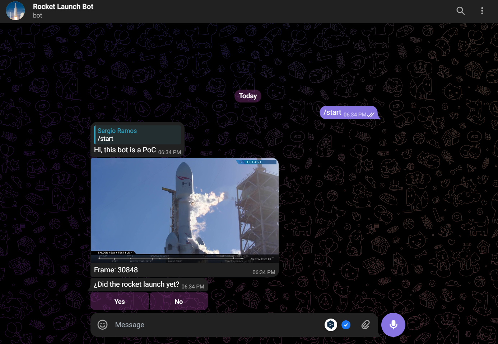
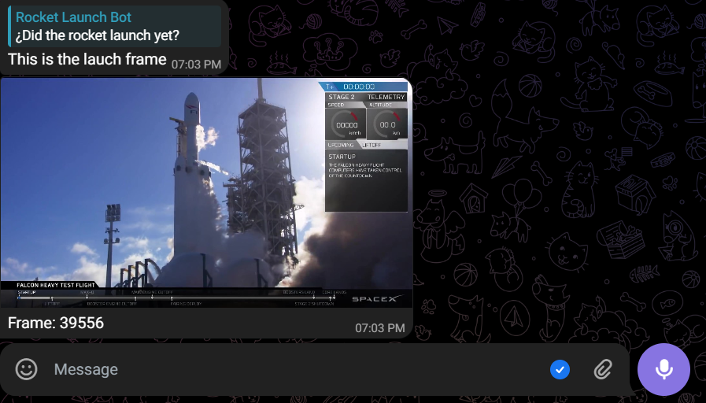
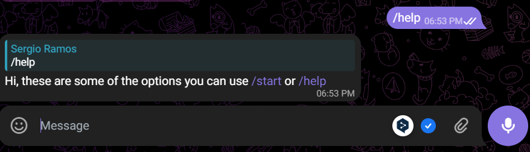

# When Did The Rocket Launch Telegram

This is the solution to the telegram bot exercise with the objective of asking the user when the rocket took off from the <a target="_blank" href="https://www.youtube.com/watch?v=wbSwFU6tY1c&t=1328s&pp=ygUGc3BhY2V4"> video provided by the FrameX API, you can find the in this link:

- Rocket Launch Bot: `t.me/rocketlaunchtestbot`

|                           Table of contents                           |
| :-------------------------------------------------------------------: |
|                   [How to execute](#how-to-execute)                   |
|                         [Solution](#solution)                         |
| [How to use the Rocket Launch Bot](#how-to-use-the-rocket-launch-bot) |

### How to execute

In order to execute the project without problems, you must carry out the following steps.

1. Create an `.env` file which will have the environment variable `TOKEN_BOT` with the token provided by telegram. The `.env` file should look like this.

```bash
TOKEN_BOT="YOUR_TELEGRAM_TOKEN"
```

2. Create a virtual environment to install the dependencies using pip.

```bash
python3 -m venv venv
source venv/bin/activate
pip3 install -r requirements.txt
```

3. You must run the `main.py` file located in the `src/` folder.

```bash
python3 src/main.py
```

### Solution

In order to solve the proposed PoC, I have used the OOP architecture, as this is a project-oriented architecture which can make the code more maintainable thanks to the handling of attributes and methods facilitating the handling of states and values that can be used in different parts of the project without the need of having to repeat code.

### Code structure

```bash
src/
├── api.py
├── bot.py
├── launch_service.py
├── main.py
└── requirements.txt
```

|                    File                    |                               Description                                |
| :----------------------------------------: | :----------------------------------------------------------------------: |
|            [api.py](src/api.py)            |      Abstracts the main logic of interactions with the FrameX API.       |
|            [bot.py](src/bot.py)            |        Abstracts the main logic of interactions with telegram bot        |
| [launch_service.py](src/launch_service.py) | Abstracts the main logic to obtain the frame where the rocket takes off. |

### How to use the Rocket Launch Bot

To operate the bot, you can use the following commands `/start` and `/help`, you can find the bot in this link.
- Rocket Launch Bot: `t.me/rocketlaunchtestbot`

#### Commands

- `/start`
  This command starts the search of the frames where it will ask the user, if the rocket has already taken off or not, with different images.
  

The final result should be like the next image whit the frame of the moment that the rocket takes off.



- `/help`
  Shows the user the available bot commands.
  
